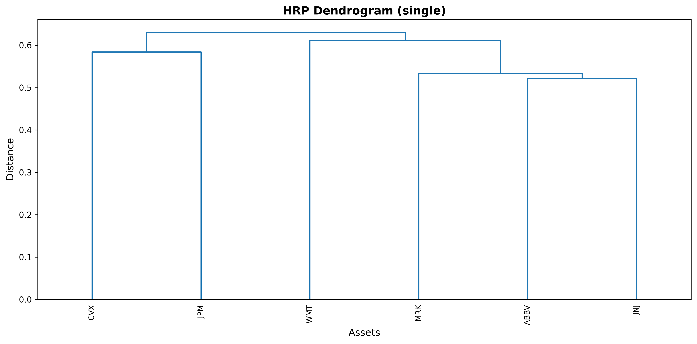
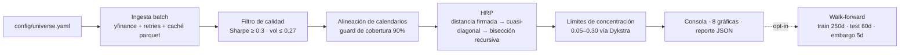
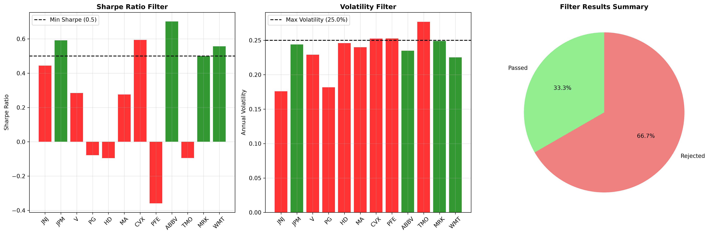
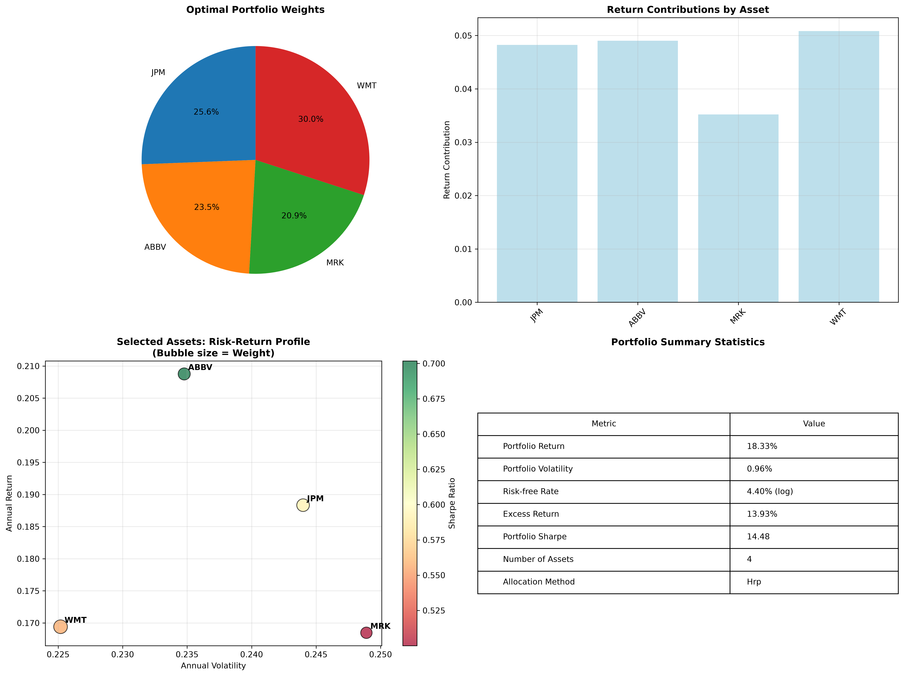

# Hierarchical Clustering Portfolio Selector

[](https://github.com/andresbetov/hierarchical-clustering-portfolio-selector/actions/workflows/ci.yml)
[](https://github.com/andresbetov/hierarchical-clustering-portfolio-selector/releases)
[](https://github.com/andresbetov/hierarchical-clustering-portfolio-selector/blob/develop/pyproject.toml)
[](LICENSE)

**Convierte un universo amplio de acciones en una cartera interpretable y balanceada por riesgo: clustering jerárquico sobre distancia de correlación firmada, asignación Hierarchical Risk Parity sin invertir la covarianza, límites de concentración y validación walk-forward — con cada decisión metodológica versionada y testeada.**

Esto no es un predictor de precios. Es un motor de construcción de carteras auditable, construido como proyecto de portafolio de investigación e ingeniería: cada corrida produce un `run_id` determinista, un reporte de diagnóstico machine-readable y ocho gráficas; el módulo walk-forward contrasta el motor contra los benchmarks 1/N e inverse-volatility sobre datos que nunca vio en entrenamiento.

**De un vistazo**

- **Stack:** Python 3.11+ · numpy · pandas · scipy · scikit-learn · yfinance · matplotlib · uv
- **Out-of-sample:** 16 folds walk-forward — Sharpe mediano 0.502 (HRP) vs 0.456 (1/N) vs **0.521** (inverse volatility). El benchmark ganó esta ventana y este README lo dice desde el inicio.
- **Ingeniería:** 367 tests offline · CI en Python 3.11/3.12/3.13 · umbral de cobertura 85% · fingerprints de corrida deterministas · 51 funcionalidades y fixes entregados con harness OpenSpec/ADR
- **Estado:** instrumento de investigación y educación; **no** es asesoría de inversión



**Ir a:** [Inicio rápido](#inicio-rápido) · [Qué hace](#qué-hace) · [Cómo funciona](#cómo-funciona) · [Resultados](#resultados) · [Ingeniería](#ingeniería-y-verificación) · [Limitaciones](#alcance-y-limitaciones) · [Autor](#autor)

## Qué hace

Cinco etapas encadenadas, cada una con contrato testeado:

1. **Ingesta** — descarga batch de precios ajustados con reintentos acotados y caché parquet opcional; cada ticker rechazado se nombra individualmente.
2. **Filtrado** — Sharpe mínimo y volatilidad máxima por ticker sobre su propia historia; las métricas no finitas se excluyen con el motivo adjunto.
3. **Alineación** — intersección de calendarios antes de cualquier estadística multivariante, más un guard de cobertura (`minimum_overlap_ratio=0.9`) que excluye tickers con historia corta con warning nombrado en vez de truncar silenciosamente a todos.
4. **Clustering + asignación** — distancia firmada `sqrt(0.5·(1−ρ))` para que los hedges nunca se fusionen con cuasi-duplicados, y luego HRP canónico: linkage → cuasi-diagonalización → bisección recursiva por varianza inversa de clúster. Sin inversión de matrices.
5. **Restricciones** — límites simultáneos 0.05–0.30 vía proyecciones cíclicas de Dykstra, con verificación dura post-convergencia que lanza excepción en vez de devolver un vector violado.

Qué obtienes por corrida:

- Resumen en consola con pesos finales y retorno/volatilidad/Sharpe por activo.
- Ocho gráficas de diagnóstico en `charts/` (dendrograma, matrices de correlación, embudo de filtrado, resumen de asignación y más).
- `reports/technical-report.json` — con versión de esquema y secciones de exclusiones con distancia al umbral, diagnóstico de asignación (HHI, ratio de diversificación, contribuciones de riesgo, telemetría Dykstra), riesgo in-sample (Sortino, VaR/CVaR 95, drawdown/Calmar), salud del árbol y una sección walk-forward opcional.

## Inicio rápido

Requisitos: **Python ≥ 3.11** y [uv](https://docs.astral.sh/uv/). La primera corrida necesita red (Yahoo Finance vía `yfinance`); las siguientes reutilizan `data/cache/` (indexado por ventana, así que un día nuevo re-descarga).

```bash
git clone https://github.com/andresbetov/hierarchical-clustering-portfolio-selector.git
cd hierarchical-clustering-portfolio-selector
uv sync
uv run portfolio-run                     # charts/ + reports/technical-report.json
uv run portfolio-run --walk-forward      # añade validación out-of-sample al reporte
```

Salida abreviada en consola de la corrida estándar:

```text
Asset    Weight     Return       Volatility   Sharpe
ABBV     12.23%     0.2061       0.2349       0.69
CVX      17.10%     0.1975       0.2526       0.61
JNJ      21.78%     0.1228       0.1760       0.45
JPM      15.28%     0.1856       0.2442       0.58
MRK      15.67%     0.1719       0.2489       0.51
WMT      17.95%     0.1687       0.2253       0.55
----------------------------------------------------------------------
Total    100.00%    0.1713
```

El universo vive en `config/universe.yaml` (un ticker por entrada): edítalo para analizar otro mercado o pasa `--universe path/to/file.yaml`.

## Referencia CLI

| Flag | Default | Descripción |
| --- | --- | --- |
| `--universe PATH` | `config/universe.yaml` | YAML con un ticker por entrada |
| `--method METHOD` | `hrp` | `equal`, `inverse_volatility`, `risk_parity`, `max_sharpe`, `min_variance`, `hrp` |
| `--covariance-estimator METHOD` | `sample` | `sample`, `ledoit_wolf`, `oas` (ADR 005) |
| `--linkage METHOD` (`--linkage-method`) | `single` | `single`, `ward`, `average` (ADR 006) |
| `--save` / `--no-save` | `--save` | Escribe las ocho gráficas en `charts/` |
| `--show` / `--no-show` | `--no-show` | Abre ventanas interactivas (requiere display) |
| `--refresh-cache` | off | Ignora `data/cache/` y fuerza re-descarga |
| `--walk-forward` | off | Añade validación out-of-sample al reporte JSON (reestima por ventana) |

El reporte JSON se escribe en cada corrida exitosa en `reports/technical-report.json` (no configurable; cuando la ingesta no devuelve ningún activo, la generación de gráficas aborta antes del reporte — ver [limitaciones](#alcance-y-limitaciones)); `--no-save` afecta solo a las gráficas.

## Cómo funciona



| Capa | Responsabilidad |
| --- | --- |
| `core/` | Config inmutable validada, métricas vectorizadas, logging |
| `data/` | Protocolo de provider, ingesta batch yfinance, caché parquet, universo YAML |
| `portfolio/` | Filtrado, selección legacy, HRP canónico, asignación y restricciones |
| `validation/` | Evaluación walk-forward out-of-sample con embargo |
| `viz/` | Las ocho gráficas de diagnóstico (matplotlib confinado aquí) |
| `app/` | Orquestación con provider inyectable y ensamblado del reporte JSON |
| `cli.py` | Parseo de argumentos y entrypoint de consola |

Decisiones clave (ver [ADRs](docs/adr/README.md)):

- **Distancia firmada** `sqrt(0.5·(1−ρ))` en vez de `1−|ρ|`: los activos negativamente correlacionados son un hedge, no un duplicado (ADR 002).
- **HRP en vez de media-varianza**: sin inversión de covarianza, diseñado para ser más estable que los optimizadores cuadráticos (ADR 003) — aunque esta corrida igual muestra ~35% de turnover implícito de ida por reajuste.
- **Proyección Dykstra** post-hoc que minimiza distancia euclídea al vector HRP puro; deliberadamente no preserva el balance jerárquico de riesgo (addendum ADR 003).
- **Covarianza y linkage configurables** (`sample`/`ledoit_wolf`/`oas`; `single`/`ward`/`average`), con defaults fieles al paper y compatibles con snapshots hasta que la evidencia walk-forward justifique el cambio (ADRs 005–006).
- **Umbrales de filtrado** recalibrados a 0.3/0.27 con evidencia walk-forward (ADR 007).

## Resultados

Todas las cifras provienen de una corrida del motor, con snapshot en este repositorio (2026-09-10):

- Universo: 12 acciones large-cap de EE. UU. de [`config/universe.yaml`](config/universe.yaml).
- Ventana: 2021-09-09 → 2026-09-08 · 1,253 observaciones diarias.
- `run_id` determinista: `97e3a2e4d5953986` (fingerprint de versión del motor + config + universo + ventana).
- Snapshot del reporte: [`docs/results/technical-report-2026-09-10.json`](docs/results/technical-report-2026-09-10.json).

Regenera el reporte con:

```bash
uv run portfolio-run --walk-forward
```

Una corrida nueva usa la ventana de datos actual, así que producirá cifras y un `run_id` distintos a los del snapshot de arriba.

### Out-of-sample primero (16 folds walk-forward)

Los pesos se ajustan solo con una ventana de entrenamiento de 250 filas, se congelan y se aplican a las 60 filas siguientes, separadas por un embargo de 5 días. Ambos benchmarks reciben los mismos retornos out-of-sample y el mismo conjunto ex-ante de supervivientes.

| Estrategia | Sharpe OOS mediano | Retorno OOS mediano (anualizado) | Volatilidad OOS mediana (anualizada) |
| --- | ---: | ---: | ---: |
| **HRP (este motor)** | 0.502 | 10.12% | 13.15% |
| Equal weight (1/N) | 0.456 | 9.91% | 13.30% |
| Inverse volatility | **0.521** | **10.43%** | 13.16% |

Lectura honesta: **inverse volatility superó a HRP en esta ventana**, 81% de los folds de HRP tuvieron retorno OOS positivo, 5 de 16 folds necesitaron relajar los límites de concentración (conjuntos pequeños de supervivientes) y la deriva mediana de pesos entre folds consecutivos es 0.69 en distancia L1 — aproximadamente 35% de turnover implícito de ida por cada reajuste de 60 días. La dispersión entre folds es amplia (IQR del Sharpe HRP [0.10, 2.15], rango completo [−2.07, 4.43]), así que la diferencia mediana de 0.019 entre HRP e inverse volatility queda muy dentro del ruido: trata el ranking como no concluyente, no como una victoria. Los umbrales de filtrado 0.3/0.27 se seleccionaron usando folds walk-forward del mismo diseño (ADR 007), así que esto es un contraste direccional, no una validación limpia de hiperparámetros. Sin costos de transacción ni control de turnover modelados, estas cifras no son P&L esperado. Por eso el proyecto declara explícitamente que no está listo para decisiones de inversión (ver [Alcance y limitaciones](#alcance-y-limitaciones)).

### Diagnóstico in-sample (misma corrida)

| Métrica | Valor |
| --- | ---: |
| Supervivientes del filtro | 6 de 12 (Sharpe ≥ 0.3, volatilidad ≤ 0.27) |
| Retorno de cartera (anualizado, convención log) | 17.13% |
| Volatilidad de cartera (anualizada) | 13.61% |
| Sharpe de cartera (convención log) | 0.94 |
| Ratio de Sortino | 1.34 |
| VaR 95% (diario) | 1.31% |
| CVaR 95% (diario) | 1.90% |
| Máximo drawdown | −14.17% |
| Ratio de Calmar | 1.21 |
| HHI / número efectivo de activos | 0.172 / 5.82 |
| Ratio de diversificación | 1.67 |
| Tasa de chaining del árbol (umbral 0.60) | 0.40 — sin flag de chaining |
| Telemetría de restricciones | 0 pesos modificados (límites inactivos en esta corrida) |

Pesos finales: ABBV 12.2% · CVX 17.1% · JNJ 21.8% · JPM 15.3% · MRK 15.7% · WMT 17.9%. Estos pesos y la volatilidad/Sharpe de cartera provienen de la gráfica de asignación; el snapshot JSON guarda diagnósticos de asignación y pesos por fold del walk-forward, pero todavía no el vector final in-sample de pesos (ver roadmap).

Los Sharpe siguen la convención logarítmica del motor (`exceso = media del log-retorno − ln(1+rf)`); no son directamente comparables con Sharpe aritméticos.

### Gráficas





Las ocho gráficas se regeneran en cada corrida dentro de `charts/`; las copias incluidas en este repositorio corresponden a la corrida mostrada arriba. Consulta el [catálogo de diagnósticos](docs/diagnostics-catalog.md) para interpretar cada una.

## Ingeniería y verificación

- **367 tests offline** (unitarios, propiedades con Hypothesis, integración y end-to-end). CI corre completamente sin red: el provider se inyecta y el seam de red está monkeypatcheado.
- **Verificación local en un comando** — `./init.sh`: sync de dependencias con `uv sync --frozen` (igual que CI), pytest con umbral de cobertura combinada del 85%, `ruff`, `pyright` y chequeo de compilación.
- **Matriz CI** en Python 3.11 / 3.12 / 3.13 con `uv sync --frozen` (lockfile versionado) y artefactos de cobertura por versión.
- **Determinismo**: fixtures con semillas independientes de `PYTHONHASHSEED`, fingerprint de reporte sin reloj de pared y convenciones numéricas fijadas.
- **Tests anti-fuga**: mutar la ventana out-of-sample no cambia los pesos congelados y el primer día OOS se valora con el último cierre previo a la ventana de test (la fila del embargo).
- **Modos de fallo nombrados**: tickers inválidos, historias con bajo solapamiento, corrupción de caché y folds degenerados degradan con warning explícito o entrada `skipped` en el reporte; si falta `pyarrow`, se opera sin caché con un warning.

## Construido con un harness de ingeniería de agentes

Este proyecto se desarrolló con un agente de codificación de IA bajo un harness a nivel de repositorio diseñado para que la velocidad no sacrifique la verificabilidad:

- [`AGENTS.md`](AGENTS.md) define el flujo de arranque, los límites de alcance y una definición de done que exige evidencia verde fresca antes de cerrar una funcionalidad.
- [`feature_list.json`](feature_list.json) registra 51 funcionalidades entregadas con evidencia por sesión; [`openspec/`](openspec/) contiene 13 specs de capacidades y cambios archivados, y [`docs/adr/`](docs/adr/README.md) registra cada decisión metodológica.
- Las revisiones adversariales con subagentes independientes han detectado defectos reales — por ejemplo, un guard que aceptaba folds walk-forward degenerados como válidos y un crash de generación de gráficas con tickers de historia corta, ambos corregidos con tests de regresión (feat-035, feat-037).

El harness es parte del entregable: es lo que hace que una base de código asistida por IA sea revisable por un tercero.

## Metodología y registro de decisiones

`PortfolioConfig` es inmutable y validado en construcción. Los parámetros que más directamente moldean los resultados:

| Parámetro | Default | Notas |
| --- | --- | --- |
| `minimum_sharpe_threshold` | `0.3` | ADR 007 |
| `maximum_volatility_threshold` | `0.27` | ADR 007 |
| `covariance_estimator` | `sample` | `ledoit_wolf` y `oas` disponibles (ADR 005) |
| `linkage_method` | `single` | `ward` y `average` disponibles (ADR 006) |
| `lookback_years` | `5` | Ventana por calendario con clamp de año bisiesto |
| `minimum_overlap_ratio` | `0.9` | Cobertura vs. el span de unión del calendario |
| `risk_free_rate` | `0.045` | Log-coherente: `ln(1+rf) ≈ 0.0440` |
| `weight_allocation_method` | `hrp` | Seis métodos disponibles |
| `minimum_single_asset_weight` / `maximum_single_asset_weight` | `0.05` / `0.30` | Verificación dura tras la proyección |

`distance_metric` y `maximum_correlation_threshold` configuran la ruta legacy no-HRP; la ruta HRP siempre usa la distancia firmada del ADR 002.

Referencias:

- López de Prado, M. (2016). *Building Diversified Portfolios that Outperform Out of Sample*. Journal of Portfolio Management, 42(4).
- DeMiguel, V., Garlappi, L., & Uppal, R. (2009). *Optimal Versus Naive Diversification*. Review of Financial Studies, 22(5).
- Ledoit, O., & Wolf, M. (2004). *Honey, I Shrunk the Sample Covariance Matrix*. Journal of Portfolio Management, 30(4).
- Dykstra, R. L. (1983). *An Algorithm for Restricted Least Squares Regression*. Journal of the American Statistical Association, 78(384).
- Pfitzinger, J., & Katzke, N. (2019). *Constrained Hierarchical Risk Parity*. Stellenbosch Working Paper 14/2019.

## Alcance y limitaciones

Este es un instrumento de investigación y educación. Nada de lo que produce constituye recomendación de inversión y el desempeño pasado no garantiza resultados futuros.

- **No está listo para decisiones de inversión.** Sin costos de transacción, turnover, capacidad, impuestos ni modelado intraperíodo de pesos. Las medianas walk-forward son un contraste direccional, no P&L esperado.
- **Sesgo de supervivencia.** El universo de 12 tickers es un conjunto de supervivientes a 2026; no es un universo invertible point-in-time (delistings, adquisiciones e IPOs están ausentes).
- **Dependencia de datos.** `yfinance` es una fuente pública no institucional sin SLA: disponibilidad, ajustes por acciones corporativas y cobertura cambian con la fecha de consulta, así que una corrida posterior puede dar resultados distintos.
- **El walk-forward valida solo HRP.** Pasar `--method equal|risk_parity|max_sharpe|...` todavía no está cubierto por validación out-of-sample.
- **La clave de caché incluye la ventana resuelta**, así que correr en un día nuevo dispara una descarga fresca aunque exista caché.
- **Convención de Sharpe.** Los ratios usan log-retornos y tasa libre logarítmica, no la convención aritmética.
- **Caso borde con universo vacío.** Si la ingesta deja cero activos utilizables, la generación de gráficas falla antes de escribir el reporte JSON; una salida graceful con exit distinto de cero está agendada para v0.2.0.
- **El diagnóstico in-sample puede ser optimista** por construcción (selección y asignación usan la misma muestra); prefiere la tabla out-of-sample.
- **La elección de umbrales no es limpia respecto a hiperparámetros.** Los defaults de filtrado 0.3/0.27 se seleccionaron con folds walk-forward del mismo diseño que los evalúan (ADR 007); las medianas OOS son evidencia direccional, no una validación anidada limpia.

## Roadmap (v0.2.0)

- Costos de transacción y contabilidad explícita de turnover en el walk-forward.
- Asignación HERC y optimización anidada por clústeres.
- CPCV / Sharpe deflactado / PBO para validación consciente de múltiples pruebas.
- Ledoit–Wolf como estimador default, respaldado por evidencia walk-forward.
- Manejo de universo point-in-time (delistings, IPOs) en lugar de una lista fija de supervivientes.
- Pesos finales incluidos en el reporte JSON; salida graceful con universo vacío.
- Modo `pyright` strict.

El backlog completo vive en [`feature_list.json`](feature_list.json) y [`session-handoff.md`](session-handoff.md).

## Estructura del proyecto

```text
config/universe.yaml    # Universo externalizado
docs/
├── adr/                # Decisiones metodológicas versionadas (ADR 001–007)
├── diagnostics-catalog.md
├── results/            # Snapshots de corridas (reporte JSON)
portfolio_engine/
├── core/               # Config inmutable, métricas vectorizadas, logging
├── data/               # Protocolo de provider, ingesta yfinance, caché, universo
├── portfolio/          # Filtrado, selección legacy, HRP, asignación + restricciones
├── validation/         # Walk-forward out-of-sample con embargo
├── viz/                # Gráficas y métricas de resumen
└── app/                # Orquestación + ensamblado del reporte técnico
scripts/                # Entrypoint legacy wrapper
tests/                  # Unitarios + propiedades + end-to-end offline
openspec/               # Specs de capacidades y propuestas de cambio archivadas
```

## Autor

Construido por **Andrés Bermúdez** — ingeniero backend que construye sistemas de nivel producción con un componente cuantitativo impulsado por IA. Ingeniería de Sistemas en Universidad ECCI (Bogotá); este repositorio hace parte de un portafolio que también incluye una plataforma de microservicios Spring Cloud y un pipeline de ML de volatilidad validado out-of-sample.

- GitHub: [@andresbetov](https://github.com/andresbetov)
- LinkedIn: [in/andresbetov](https://www.linkedin.com/in/andresbetov/)

Abierto a roles de ingeniería backend, microservicios, fintech y sistemas impulsados por IA.

## Licencia

[Apache-2.0](LICENSE). Los datos de mercado se obtienen de Yahoo Finance vía `yfinance` para investigación y uso personal, sujetos a los términos de Yahoo; este repositorio no redistribuye datos de mercado.

Construido sobre numpy, pandas, scipy, scikit-learn, matplotlib, seaborn y pyarrow; verificado con pytest, Hypothesis, ruff y pyright.

---

[Read in English](README.md)
