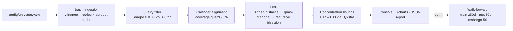

# Hierarchical Clustering Portfolio Selector

[](https://github.com/andresbetov/hierarchical-clustering-portfolio-selector/actions/workflows/ci.yml)
[](https://github.com/andresbetov/hierarchical-clustering-portfolio-selector/releases)
[](https://github.com/andresbetov/hierarchical-clustering-portfolio-selector/blob/develop/pyproject.toml)
[](LICENSE)

**Turns a broad equity universe into an interpretable, risk-balanced portfolio: hierarchical clustering on a signed correlation distance, Hierarchical Risk Parity allocation without inverting the covariance matrix, concentration constraints, and walk-forward validation — with every methodological decision versioned and tested.**

This is not a price predictor. It is an auditable portfolio-construction engine built as a research and engineering portfolio project: each run produces a deterministic `run_id`, a machine-readable diagnostic report, and eight charts, and the walk-forward module contrasts the engine against 1/N and inverse-volatility benchmarks on data it never trained on.

**At a glance**

- **Stack:** Python 3.11+ · numpy · pandas · scipy · scikit-learn · yfinance · matplotlib · uv
- **Out-of-sample:** 16 walk-forward folds — median Sharpe 0.502 (HRP) vs 0.456 (1/N) vs **0.521** (inverse volatility). The benchmark won this window, and this README says so up front.
- **Engineering:** 367 offline tests · CI on Python 3.11/3.12/3.13 · 85% coverage gate · deterministic run fingerprints · 51 tracked features and fixes shipped through an OpenSpec/ADR harness
- **Status:** research and education instrument; **not** investment advice


**Jump to:** [Quickstart](#quickstart) · [What it does](#what-it-does) · [How it works](#how-it-works) · [Results](#results) · [Engineering](#engineering--verification) · [Limitations](#scope--limitations) · [Author](#author)

## What it does

Five chained stages, each with a tested contract:

1. **Ingest** — batch download of adjusted prices with bounded retries and an optional parquet cache; rejected tickers are named individually.
2. **Filter** — minimum Sharpe and maximum volatility per ticker on its own history; non-finite metrics are excluded with the reason attached.
3. **Align** — calendar intersection before any multivariate statistic, plus a coverage guard (`minimum_overlap_ratio=0.9`) that drops short-history tickers with a named warning instead of silently truncating everyone.
4. **Cluster + allocate** — signed distance `sqrt(0.5·(1−ρ))` so hedges are never merged with near-duplicates, then canonical HRP: linkage → quasi-diagonalization → recursive bisection on inverse cluster variance. No matrix inversion.
5. **Constrain** — simultaneous 0.05–0.30 weight bounds via cyclic Dykstra projections, with a hard post-convergence verification that raises instead of returning a violating vector.

What you get per run:

- A console summary with final weights and per-asset return/volatility/Sharpe.
- Eight diagnostic charts in `charts/` (dendrogram, correlation matrices, filter funnel, allocation summary, and more).
- `reports/technical-report.json` — schema-versioned with sections for exclusions and distances to threshold, allocation diagnostics (HHI, diversification ratio, risk contributions, Dykstra telemetry), in-sample risk (Sortino, VaR/CVaR 95, drawdown/Calmar), tree health, and an opt-in walk-forward section.

## Quickstart

Requirements: **Python ≥ 3.11** and [uv](https://docs.astral.sh/uv/). The first run needs network access (Yahoo Finance via `yfinance`); later runs reuse `data/cache/` (window-keyed, so a new day re-downloads).

```bash
git clone https://github.com/andresbetov/hierarchical-clustering-portfolio-selector.git
cd hierarchical-clustering-portfolio-selector
uv sync
uv run portfolio-run                     # charts/ + reports/technical-report.json
uv run portfolio-run --walk-forward      # adds out-of-sample validation to the report
```

Abridged console output of the standard run:

```text
Asset    Weight     Return       Volatility   Sharpe
ABBV     12.23%     0.2061       0.2349       0.69
CVX      17.10%     0.1975       0.2526       0.61
JNJ      21.78%     0.1228       0.1760       0.45
JPM      15.28%     0.1856       0.2442       0.58
MRK      15.67%     0.1719       0.2489       0.51
WMT      17.95%     0.1687       0.2253       0.55
----------------------------------------------------------------------
Total    100.00%    0.1713
```

The universe lives in `config/universe.yaml` (one ticker per entry) — edit it to analyze another market, or pass `--universe path/to/file.yaml`.

## CLI reference

| Flag | Default | Description |
| --- | --- | --- |
| `--universe PATH` | `config/universe.yaml` | YAML file with one ticker per entry |
| `--method METHOD` | `hrp` | `equal`, `inverse_volatility`, `risk_parity`, `max_sharpe`, `min_variance`, `hrp` |
| `--covariance-estimator METHOD` | `sample` | `sample`, `ledoit_wolf`, `oas` (ADR 005) |
| `--linkage METHOD` (`--linkage-method`) | `single` | `single`, `ward`, `average` (ADR 006) |
| `--save` / `--no-save` | `--save` | Write the eight charts to `charts/` |
| `--show` / `--no-show` | `--no-show` | Open interactive windows (requires a display) |
| `--refresh-cache` | off | Ignore `data/cache/` and force a re-download |
| `--walk-forward` | off | Add out-of-sample validation to the JSON report (refits per window) |

The JSON report is written on every successful run to `reports/technical-report.json` (not configurable; when ingestion returns no assets at all, chart generation aborts before the report — see [limitations](#scope--limitations)); `--no-save` affects charts only.

## How it works



| Layer | Responsibility |
| --- | --- |
| `core/` | Immutable validated config, vectorized metrics, logging |
| `data/` | Provider protocol, batch yfinance ingestion, parquet cache, YAML universe |
| `portfolio/` | Filtering, legacy selection, canonical HRP, allocation and constraints |
| `validation/` | Walk-forward out-of-sample evaluation with embargo |
| `viz/` | The eight diagnostic charts (matplotlib confined here) |
| `app/` | Orchestration with injectable provider and JSON report builder |
| `cli.py` | Argument parsing and console entrypoint |

Key decisions (see [ADRs](docs/adr/README.md)):

- **Signed distance** `sqrt(0.5·(1−ρ))` rather than `1−|ρ|`: negatively correlated assets are a hedge, not a duplicate (ADR 002).
- **HRP instead of mean-variance**: no covariance inversion, designed to be more stable than quadratic optimizers (ADR 003) — though this run still shows ~35% implied one-way turnover per refit.
- **Dykstra projection** is post-hoc and minimizes Euclidean distance to the raw HRP vector — it deliberately does not preserve hierarchical risk balance (ADR 003 addendum).
- **Configurable covariance and linkage** (`sample`/`ledoit_wolf`/`oas`; `single`/`ward`/`average`), with defaults kept at the paper-faithful, snapshot-compatible values until walk-forward evidence supports a flip (ADRs 005–006).
- **Filter thresholds** recalibrated to 0.3/0.27 with walk-forward evidence (ADR 007).

## Results

All numbers below come from one engine run, snapshotted in this repository (2026-09-10):

- Universe: 12 large-cap US equities from [`config/universe.yaml`](config/universe.yaml).
- Window: 2021-09-09 → 2026-09-08 · 1,253 daily observations.
- Deterministic run ID: `97e3a2e4d5953986` (fingerprint of engine version + config + universe + window).
- Report snapshot: [`docs/results/technical-report-2026-09-10.json`](docs/results/technical-report-2026-09-10.json).

Regenerate the report with:

```bash
uv run portfolio-run --walk-forward
```

A fresh run uses the current data window, so it will produce different numbers and a different `run_id` than the snapshot above.

### Out-of-sample first (16 walk-forward folds)

Weights are fitted only on a 250-row training window, frozen, and applied to the following 60 rows, separated by a 5-day embargo. Both benchmarks receive the same out-of-sample returns and the same ex-ante survivor set.

| Strategy | Median OOS Sharpe | Median OOS return (annualized) | Median OOS volatility (annualized) |
| --- | ---: | ---: | ---: |
| **HRP (this engine)** | 0.502 | 10.12% | 13.15% |
| Equal weight (1/N) | 0.456 | 9.91% | 13.30% |
| Inverse volatility | **0.521** | **10.43%** | 13.16% |

Read this honestly: **inverse volatility edged out HRP in this particular window**, 81% of HRP folds had a positive OOS return, 5 of 16 folds needed relaxed concentration bounds (small survivor sets), and the median weight drift between consecutive folds is 0.69 in L1 distance — roughly 35% implied one-way turnover per 60-day refit. Fold-level dispersion is wide (HRP Sharpe IQR [0.10, 2.15], full range [−2.07, 4.43]), so the 0.019 median gap between HRP and inverse volatility sits well inside the noise: treat the ranking as inconclusive, not as a win. The 0.3/0.27 filter thresholds were themselves selected using walk-forward folds of the same design (ADR 007), so this is a directional contrast, not a hyperparameter-clean validation. With no transaction costs or turnover control modeled, these figures are not expected P&L. That is why the project is explicitly not ready for investment decisions (see [Scope & limitations](#scope--limitations)).

### In-sample diagnostics (same run)

| Metric | Value |
| --- | ---: |
| Filter survivors | 6 of 12 (Sharpe ≥ 0.3, volatility ≤ 0.27) |
| Portfolio return (annualized, log convention) | 17.13% |
| Portfolio volatility (annualized) | 13.61% |
| Portfolio Sharpe (log convention) | 0.94 |
| Sortino ratio | 1.34 |
| VaR 95% (daily) | 1.31% |
| CVaR 95% (daily) | 1.90% |
| Max drawdown | −14.17% |
| Calmar ratio | 1.21 |
| HHI / effective number of assets | 0.172 / 5.82 |
| Diversification ratio | 1.67 |
| Tree chaining rate (threshold 0.60) | 0.40 — no chaining flag |
| Constraint telemetry | 0 weights changed (bounds inactive in this run) |

Final weights: ABBV 12.2% · CVX 17.1% · JNJ 21.8% · JPM 15.3% · MRK 15.7% · WMT 17.9%. These weights and the portfolio-level volatility/Sharpe come from the allocation chart; the JSON snapshot stores allocation diagnostics and per-fold walk-forward weights, but not the final in-sample weight vector yet (see roadmap).

Sharpe ratios follow the engine's log-return convention (`excess = mean log-return − ln(1+rf)`); they are not directly comparable to arithmetic Sharpe ratios.

### Charts


All eight charts are regenerated on every run into `charts/`; the copies in this repository correspond to the run above. See the [diagnostics catalog](docs/diagnostics-catalog.md) for how to read each one.

## Engineering & verification

- **367 offline tests** (unit, property-based with Hypothesis, integration, end-to-end). CI runs fully offline: the data provider is injected and the network seam is monkeypatched.
- **One-command local verification** — `./init.sh`: dependency sync with `uv sync --frozen` (same as CI), pytest with an 85% combined coverage floor, `ruff`, `pyright`, and a compile check.
- **CI matrix** on Python 3.11 / 3.12 / 3.13 using `uv sync --frozen` (lockfile committed), with coverage artifacts per version.
- **Determinism**: seeded fixtures independent of `PYTHONHASHSEED`, no wall-clock in the report fingerprint, and pinned numeric conventions.
- **Anti-leakage tests**: mutating the out-of-sample window does not change the frozen weights, and the first out-of-sample day is priced from the last close before the test window (the embargo row).
- **Named failure modes**: invalid tickers, low-overlap histories, cache corruption and degenerate folds degrade with an explicit warning or a `skipped` report entry; a missing `pyarrow` falls back to no cache with a warning.

## Built with an agentic engineering harness

This project was developed with an AI coding agent under a repository-level harness designed so speed does not trade away verifiability:

- [`AGENTS.md`](AGENTS.md) defines the startup workflow, scope limits, and a definition of done that requires fresh green evidence before a feature is closed.
- [`feature_list.json`](feature_list.json) tracks 51 shipped features with per-session evidence; [`openspec/`](openspec/) holds 13 capability specs and archived changes, and [`docs/adr/`](docs/adr/README.md) records every methodological decision.
- Adversarial review passes with independent subagents have caught real defects — for example, a NaN-blind guard that accepted degenerate walk-forward folds as valid and a chart-generation crash on short-history tickers, both fixed with regression tests (feat-035, feat-037).

The harness is part of the deliverable: it is what makes an AI-assisted codebase reviewable by a third party.

## Methodology & decision records

`PortfolioConfig` is immutable and validated at construction. The parameters that most directly shape results:

| Parameter | Default | Notes |
| --- | --- | --- |
| `minimum_sharpe_threshold` | `0.3` | ADR 007 |
| `maximum_volatility_threshold` | `0.27` | ADR 007 |
| `covariance_estimator` | `sample` | `ledoit_wolf` and `oas` available (ADR 005) |
| `linkage_method` | `single` | `ward` and `average` available (ADR 006) |
| `lookback_years` | `5` | Calendar-based window with leap-year clamp |
| `minimum_overlap_ratio` | `0.9` | Coverage vs. the union calendar span |
| `risk_free_rate` | `0.045` | Log-coherent: `ln(1+rf) ≈ 0.0440` |
| `weight_allocation_method` | `hrp` | Six methods available |
| `minimum_single_asset_weight` / `maximum_single_asset_weight` | `0.05` / `0.30` | Hard-verified after projection |

`distance_metric` and `maximum_correlation_threshold` configure the legacy non-HRP selection path; the HRP path always uses the signed distance from ADR 002.

References:

- López de Prado, M. (2016). *Building Diversified Portfolios that Outperform Out of Sample*. Journal of Portfolio Management, 42(4).
- DeMiguel, V., Garlappi, L., & Uppal, R. (2009). *Optimal Versus Naive Diversification*. Review of Financial Studies, 22(5).
- Ledoit, O., & Wolf, M. (2004). *Honey, I Shrunk the Sample Covariance Matrix*. Journal of Portfolio Management, 30(4).
- Dykstra, R. L. (1983). *An Algorithm for Restricted Least Squares Regression*. Journal of the American Statistical Association, 78(384).
- Pfitzinger, J., & Katzke, N. (2019). *Constrained Hierarchical Risk Parity*. Stellenbosch Working Paper 14/2019.

## Scope & limitations

This is a research and education instrument. Nothing it produces is investment advice, and past performance does not guarantee future results.

- **Not ready for investment decisions.** No transaction costs, turnover, capacity, taxes, or intraperiod weight modeling. Walk-forward medians are a directional contrast, not expected P&L.
- **Survivorship bias.** The 12-ticker universe is a set of survivors as of 2026; it is not a point-in-time investable universe (delistings, acquisitions, and IPOs are absent).
- **Data dependency.** `yfinance` is a public, non-institutional source with no SLA: availability, corporate-action adjustments, and coverage change with the query date, so a later run can produce different results.
- **Walk-forward validates HRP only.** Passing `--method equal|risk_parity|max_sharpe|...` is not yet covered by out-of-sample validation.
- **Cache key includes the resolved window**, so running on a new day triggers a fresh download even if the cache exists.
- **Sharpe convention.** Ratios use log-returns and a log risk-free rate, not the arithmetic convention.
- **Empty universe rough edge.** If ingestion yields zero usable assets, chart generation currently fails before the JSON report is written; a graceful non-zero exit is scheduled for v0.2.0.
- **In-sample diagnostics can be optimistic** by construction (selection and allocation use the same sample); prefer the out-of-sample table.
- **Threshold choice is not hyperparameter-clean.** The 0.3/0.27 filter defaults were selected using walk-forward folds of the same design that evaluate them (ADR 007); the OOS medians are directional evidence, not a clean nested validation.

## Roadmap (v0.2.0)

- Transaction costs and explicit turnover accounting in the walk-forward.
- HERC allocation and nested clustered optimization.
- CPCV / deflated Sharpe / PBO for multiple-testing-aware validation.
- Ledoit–Wolf as the default estimator, supported by walk-forward evidence.
- Point-in-time universe handling (delistings, IPOs) instead of a fixed survivor list.
- Final weights included in the JSON report; graceful empty-universe exit.
- `pyright` strict mode.

The full backlog lives in [`feature_list.json`](feature_list.json) and [`session-handoff.md`](session-handoff.md).

## Project structure

```text
config/universe.yaml    # Externalized universe
docs/
├── adr/                # Versioned methodological decisions (ADR 001–007)
├── diagnostics-catalog.md
├── results/            # Run snapshots (JSON report)
portfolio_engine/
├── core/               # Immutable config, vectorized metrics, logging
├── data/               # Provider protocol, yfinance ingestion, cache, universe
├── portfolio/          # Filtering, legacy selection, HRP, allocation + constraints
├── validation/         # Walk-forward out-of-sample with embargo
├── viz/                # Charts and summary metrics
└── app/                # Orchestration + technical report assembly
scripts/                # Legacy wrapper entrypoint
tests/                  # Unit + property + offline end-to-end
openspec/               # Capability specs and archived change proposals
```

## Author

Built by **Andrés Bermúdez** — backend engineer building production-grade systems with an AI-driven, quantitative edge. Systems Engineering at Universidad ECCI (Bogotá); this repository is part of a portfolio that also includes a Spring Cloud microservices platform and an out-of-sample-validated volatility ML pipeline.

- GitHub: [@andresbetov](https://github.com/andresbetov)
- LinkedIn: [in/andresbetov](https://www.linkedin.com/in/andresbetov/)

Open to backend engineering, microservices, fintech, and AI-driven systems roles.

## License

[Apache-2.0](LICENSE). Market data is retrieved from Yahoo Finance through `yfinance` for research and personal use, subject to Yahoo's terms; no market data is redistributed in this repository.

Built on numpy, pandas, scipy, scikit-learn, matplotlib, seaborn, and pyarrow; verified with pytest, Hypothesis, ruff, and pyright.

---

[Leer en español](README.es.md)
