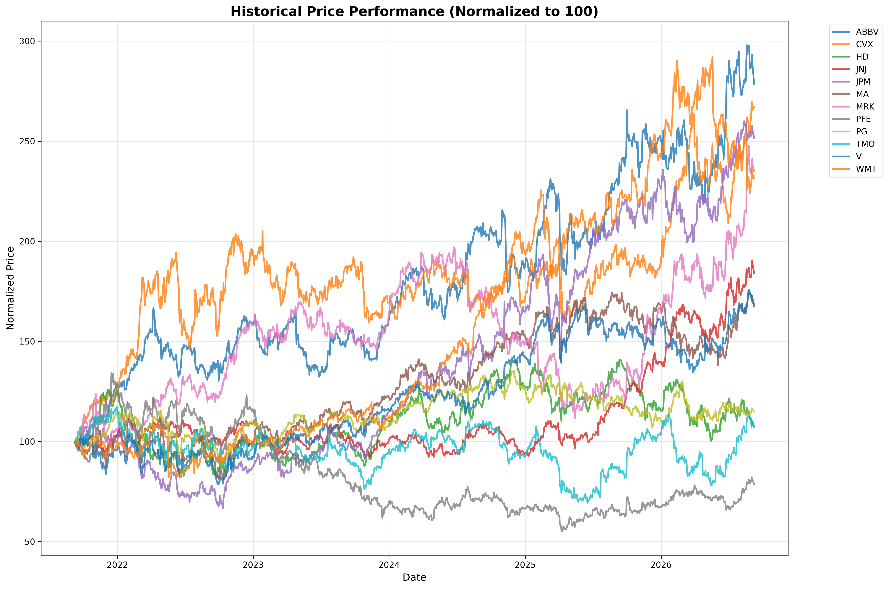
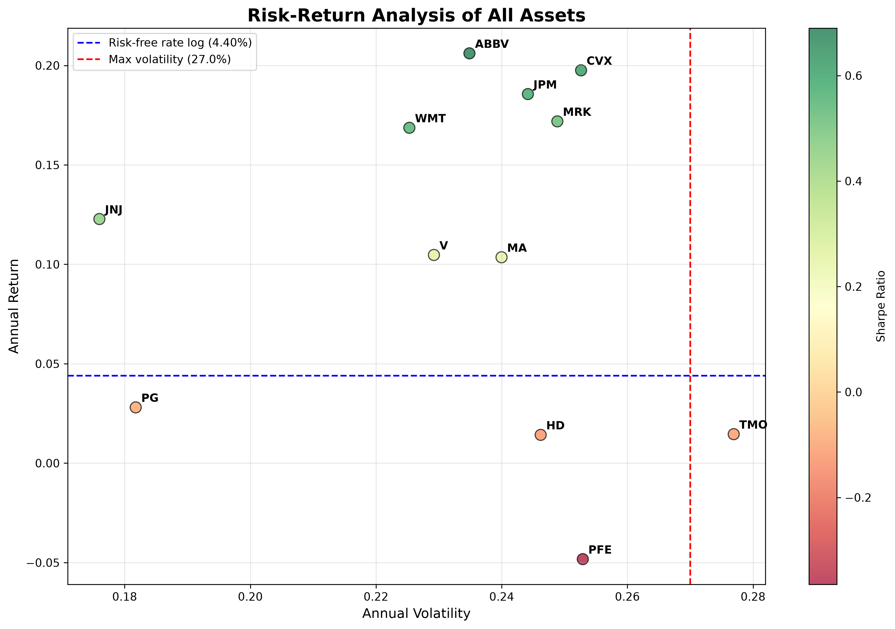
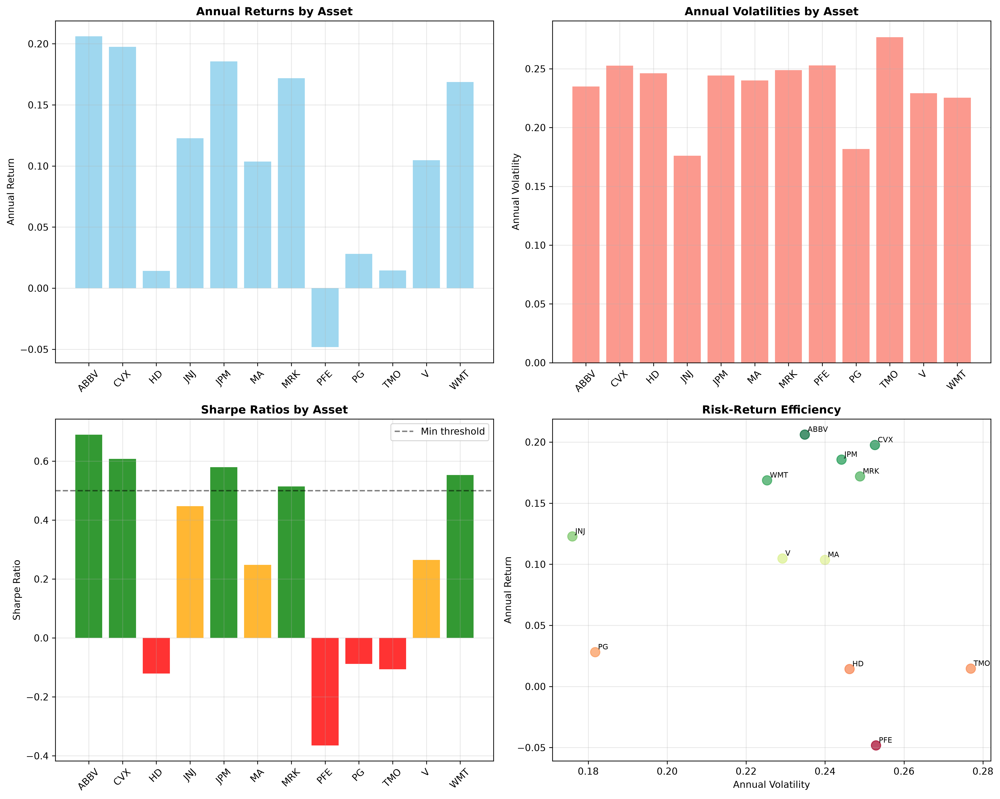
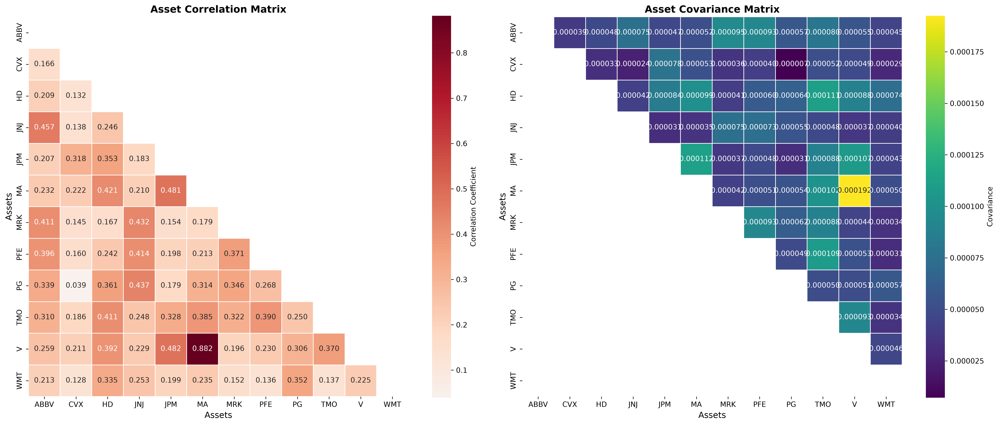
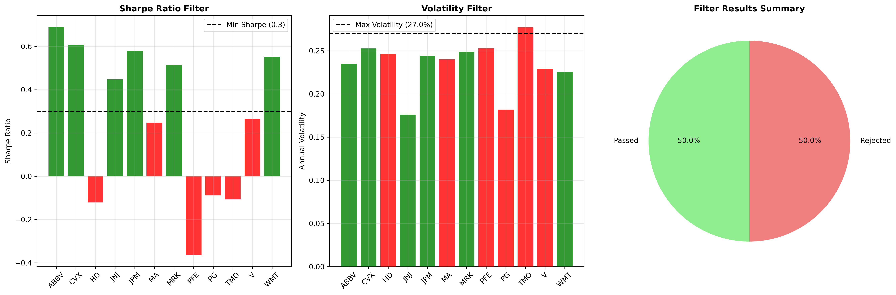
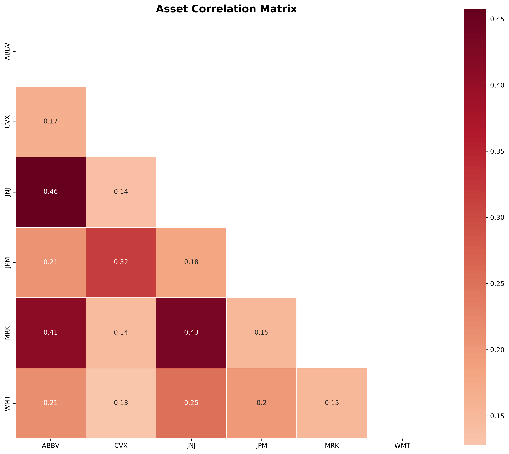
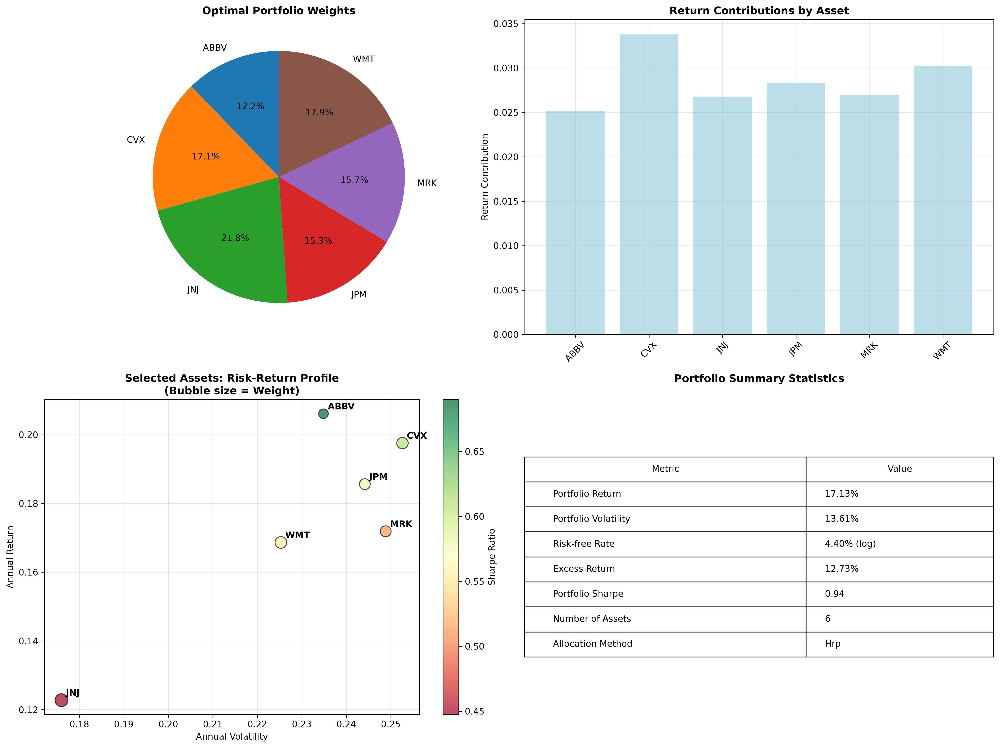

# Hierarchical Clustering Portfolio Selector

[](https://github.com/andresbetov/hierarchical-clustering-portfolio-selector/actions/workflows/ci.yml)

Pipeline cuantitativo para construir carteras de renta variable con enfoque de diversificacion efectiva. El motor descarga datos de mercado, calcula metricas de riesgo-retorno, filtra activos con criterios explicitos, reduce redundancia con clustering jerarquico y asigna pesos con `risk_parity` bajo restricciones operativas.

## Resumen ejecutivo

Este proyecto resuelve un problema concreto: pasar de un universo de activos amplio a una cartera interpretable y reproducible sin depender de decisiones discrecionales. El valor principal no es predecir precios, sino estructurar una seleccion robusta basada en calidad ajustada por riesgo, baja correlacion y control de concentracion.

El flujo termina en artefactos accionables: cartera seleccionada, pesos por activo, tabla resumen y siete graficas de diagnostico para justificar cada decision del proceso.

## Instalacion y ejecucion

```bash
uv sync
uv run scripts/assets-investment.py
```

La ejecucion genera resumen en consola y guarda figuras PNG del reporte. El script principal escribe en `charts/`; este repositorio tambien incluye ejemplos en `scripts/charts/`.

## Metodologia de seleccion

La logica de decision se compone de tres capas. Primero, filtrado minimo de calidad y riesgo. Segundo, agrupacion por similitud de comportamiento para evitar duplicar exposiciones. Tercero, asignacion de pesos para equilibrar contribucion al riesgo y limitar concentracion por activo.

Con esta secuencia, el motor evita que un solo criterio domine el resultado final. Un activo con retorno alto pero poca eficiencia de riesgo, o muy redundante frente al resto, pierde prioridad frente a candidatos mas equilibrados.

## Configuracion clave por defecto

`PortfolioConfig` representa un perfil de riesgo medio. En el estado actual del codigo, estos son los parametros que gobiernan de forma directa el resultado:

| Grupo | Parametro | Valor |
| --- | --- | --- |
| Filtrado | `minimum_sharpe_threshold` | `0.5` |
| Filtrado | `maximum_volatility_threshold` | `0.25` |
| Seleccion | `maximum_correlation_threshold` | `0.65` |
| Seleccion | `sharpe_weight` | `0.45` |
| Seleccion | `diversification_weight` | `0.35` |
| Seleccion | `volatility_penalty_weight` | `0.20` |
| Riesgo | `risk_free_rate` | `0.045` |
| Asignacion | `weight_allocation_method` | `risk_parity` |
| Asignacion | `minimum_single_asset_weight` | `0.05` |
| Asignacion | `maximum_single_asset_weight` | `0.30` |

`target_portfolio_volatility` existe en configuracion, pero hoy no se aplica como restriccion activa en la optimizacion de pesos.

## Como interpretar los resultados

La lectura profesional del output es secuencial. Si el universo filtrado cae demasiado, el problema no esta en el optimizador sino en la dureza de umbrales para ese conjunto de activos. Si el numero final de seleccionados es bajo, suele indicar alta similitud entre candidatos. Si los pesos quedan cerca de los limites minimo/maximo, la estructura de riesgo del subconjunto obliga al motor a usar restricciones de concentracion.

En otras palabras, el resultado se interpreta por consistencia del proceso, no por una cifra aislada de retorno.

## Graficas del reporte y decision que habilitan

### 1) Evolucion historica normalizada

Compara desempeno relativo desde base 100 y permite distinguir liderazgo, dispersion y cambios de tendencia entre activos sin sesgo por precio nominal.



### 2) Perfil riesgo-retorno del universo

Relaciona volatilidad, retorno y Sharpe por activo, incluyendo referencia de tasa libre de riesgo y umbral de volatilidad. Es la vista principal para detectar eficiencia de riesgo.



### 3) Dashboard de metricas por activo

Consolida retorno, volatilidad y Sharpe en panel unico para comparar calidad relativa antes de filtrar o seleccionar.



### 4) Matrices de correlacion y covarianza

Expone relaciones de co-movimiento y magnitud conjunta de variacion. Es la base tecnica para evaluar redundancia estructural del universo.



### 5) Efecto del filtrado

Audita que activos pasan o fallan por umbrales y cuantifica el impacto del embudo inicial sobre el universo analizado.



### 6) Correlacion del universo filtrado

Verifica si el subconjunto superviviente conserva correlaciones elevadas y anticipa cuanta reduccion por clustering puede esperarse.



### 7) Resumen de cartera optima

Integra pesos, contribucion a retorno, posicionamiento riesgo-retorno y metricas agregadas de la cartera final para lectura ejecutiva.



## Supuestos y limitaciones

El motor depende de datos de `yfinance`; por definicion, los resultados cambian con fecha de consulta, universo de tickers y disponibilidad de mercado. No es un sistema de pronostico de precios ni una recomendacion de inversion. Es una herramienta de seleccion y asignacion bajo reglas explicitas.

El Sharpe mostrado en el panel final es una aproximacion diagnostica del reporte y no sustituye un backtest completo con costos, turnover, fricciones ni validacion fuera de muestra.

## Reproducibilidad y verificacion

```bash
uv run pytest
```

Las pruebas cubren calculo de metricas, construccion de matrices, filtrado, seleccion y asignacion de pesos. Para trazabilidad operativa, conserva los PNG generados y el resumen de cartera en consola de cada corrida.

## Estructura del proyecto

```
portfolio_engine/
├── core/      # Configuracion, metricas y logging
├── data/      # Descarga de datos y calculo de metricas base
├── portfolio/ # Filtrado, clustering y asignacion de pesos
├── viz/       # Graficas y reportes
└── app/       # Orquestacion del pipeline
```
