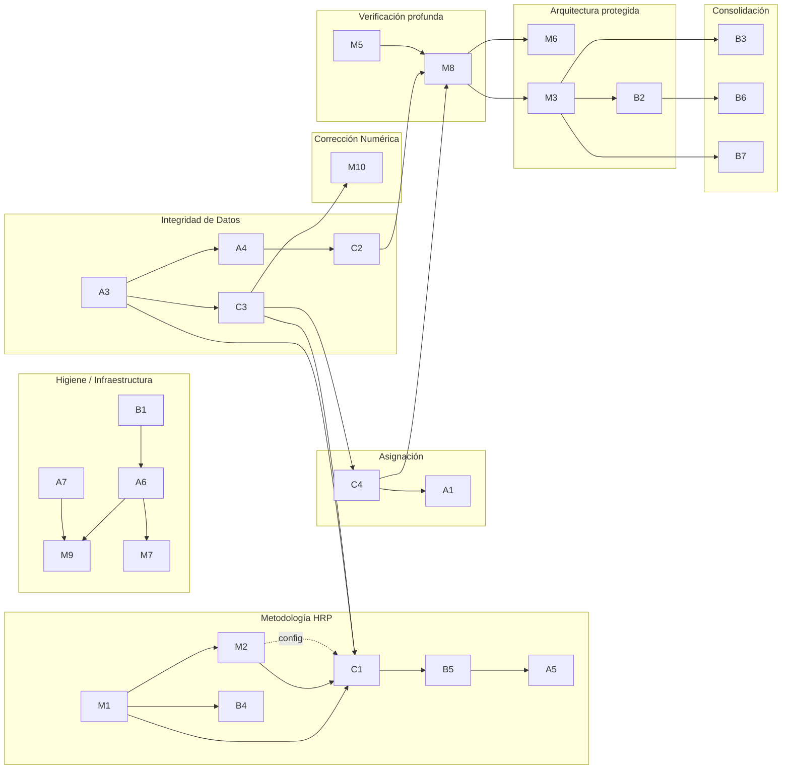

# Orden de Resolución — Grafo de Dependencias y Secuencia Cronológica

**Feature:** feat-001 · **Change:** `openspec/changes/feat-001-analisis-orden-resolucion/` · **Fecha:** 2026-08-26
**Inventario fuente:** `docs/auditoria-tecnica.md` §3 (28 hallazgos) — hipótesis inicial contrastada: §8 Fases 0-4
**Base metodológica:** topología de deuda por fan-in (periferia→centro) [JavaCodeGeeks 2026], encadenado Infraestructura→Datos→Aplicación [Keyhole 2026], resolución de ciclos contract-first [TechDebt.works]

---

## 1. Método

1. Nodos = 28 hallazgos. Aristas candidatas derivadas del roadmap §8 + análisis de código `portfolio_engine/`.
2. Regla de arista **dura**: el nodo sucesor *lee* datos/comportamiento que el predecesor modifica. Toda otra relación es **blanda** (conveniencia, mismo archivo, tema común) y se registra, no grafica.
3. Cada arista aceptada/rechazada lleva evidencia `file:line`.
4. Ordenamiento topológico; empates resueltos con criterio de trascendencia: **validez de resultados > reproducibilidad > mantenibilidad > higiene**.
5. Agrupación contigua → features `feat-002..feat-027` con `dependencies` mínimas duras.

> Principio rector: **la severidad no determina el orden — las dependencias sí.** Un CRÍTICO (C1) se ejecuta *después* de un ALTO (A3) y un MEDIO (M2) porque los consume.

---

## 2. Grafo (DAG simplificado por carriles)

Lectura por fases externas validadas (Keyhole 2026): Infraestructura (A7,B1,A6,M9,M4,M5,M7) → Datos (A2,A3,A4,C2) → Aplicación (C3,M10,M1,C4,A1,M2,B4,C1,B5,A5) → Delivery (M8,M6,M3,B2,B3,B6,B7).

---

## 3. Registro de aristas

### 3.1 Aceptadas (durás)

| ID | Arista | Consumidor → evidencia | Proveedor → evidencia | Motivo |
|----|--------|------------------------|------------------------|--------|
| E01 | A7→M9 | CI (M9) ejecutará comandos de test | `Makefile:17` apunta a `tests/smoke_test.py` inexistente | CI sin test válido = nunca verde |
| E02 | B1→A6 | A6 commitea lockfile | `.gitignore:16` ignora `uv.lock` | imposible versionar mientras esté ignorado |
| E03 | A6→M9 | configs de tools residen en `pyproject.toml` | `pyproject.toml:1-13` sin secciones tool | lint/type-check necesitan config declarada |
| E04 | A6→M7 | `[project.scripts]` exige identidad de paquete | `pyproject.toml:2` nombre fantasma; `scripts/assets-investment.py:5` `sys.path.insert` | entrypoint oficial sobre paquete bien nombrado |
| E05 | M5→M8 | tests importarán viz/reporting | `viz/reporting.py:22-23` `plt.show(block=False)`; `app/pipeline.py:203` `plt.show()` | suite sin display requiere backend Agg |
| E06 | A3→C3 | std/corr/ddof operan sobre la matriz de retornos | `core/metrics.py:121-138` `np.array(list).T` sin join de fechas; `data_fetch.py:48-50` índices por-ticker independientes | guards probados sobre series alineadas; desalineado produce NaN estructural distinto al que cubre C3 |
| E07 | C3→M10 | inverse-vol dividirá usando helper ε-floor compartido | `allocation.py:48-50` `1.0/vol` sin guard (misma clase de defecto que `metrics.py:34`) | deduplica el fix en un helper |
| E08 | C3→C4 | clip/renorm normaliza pesos salidos de risk_parity | `allocation.py:65-70` divide por `risk_contributions`; `allocation.py:118-120` `clip→/sum` | constraints iterativos necesitan pesos finitos; nan rompe el lazo |
| E09 | A3→A4 | ventana y calendario definen el recorte de series | `data_fetch.py:28-29` `timedelta(days=5*365)` fijo; `metrics.py:127` consume dicts paralelos | acoplamiento temporal en las mismas líneas: parametrizar antes de alinear duplica trabajo |
| E10 | A4→C2 | API `lookback` estable antes del rewrite batch | `data_fetch.py:42-47` loop `Ticker.history` a reemplazar | evita re-hacer la parametrización sobre el batch nuevo |
| E11 | A4→B4 | constantes 252 y ventana comparten naturaleza de calendario | `metrics.py:24,30` `*252` hardcode | mismo modelo de "día bursátil"; un solo concepto |
| E12 | C2→M8 | mock del fetch requiere contrato final (batch/fallback/cache) | `data_fetch.py:64` `except Exception: continue` indistinguible de fallo real | tests caracterizan el contrato endurecido |
| E13 | M1→M2 | `distance_metric` entra como campo validado de config | `core/config.py:1-29` clase mutable sin validación; `selection.py:105` lee threshold directo | nuevo parámetro nace sobre configuración congelada |
| E14 | M1→C1 | `cov_estimator`/`linkage_method` leerán config validada | `selection.py:86-107` lectura plana de atributos | parámetros metodológicos bajo contrato |
| E15 | M1→B4 | `trading_days_per_year` es campo de config | `config.py:8+` asignaciones `__init__` | constante configurable sobre dataclass congelada |
| E16 | M2→C1 | linkage consume la métrica de distancia elegida | `core/metrics.py:141-152` `d=1-\|corr\|`; ADR decide `signed vs abs` antes del `scipy.linkage` | reimplementar con métrica sin decidir = doble trabajo |
| E17 | A3→C1 | matrices del clustering salen del pipeline alineado | `app/pipeline.py:75-77` returns→corr/cov→`select_optimal_diversified_portfolio:79` | dendrograma sobre correlaciones mal construidas es inválido |
| E18 | C3→C1 | `scipy` linkage no admite NaN; guards garantizan matrices PSD-ish | `metrics.py:74-75` NaN explícito hoy para varianza cero | entrada del árbol sin valores no-finitos |
| E19 | C2→C1 | benchmarks comparativos (HRP vs greedy vs 1/N) exigen datos estables/cacheados | `data_fetch.py:15-67` redescarga serial cada corrida | comparación reproducible necesita proveedor estable |
| E20 | C4→A1 | vol-target escala *después* de bounds; interacción definida una vez | `allocation.py:114-121` único punto de normalización final | el scaling A1 inserta pre/post-lógica en ese punto |
| E21 | C1→B5 | solve/pinv + shrinkage reutilizan plumbing `cov_estimator` de HRP | `allocation.py:89,102` `np.linalg.inv` en ramas hermanas | un solo mecanismo de estimación para todos los métodos |
| E22 | B5→A5 | Sharpe del panel usa `wᵀΣw` real y el estimador elegido | `viz/reporting.py:308-310` `sqrt(sum((w·v)²))` asume ρ=0; `allocation.py:34-36` varianza correcta existe | panel honesto usa el mismo cálculo del motor |
| E23 | C1→M8 | fixtures/cases caracterizan jerarquías y cuasi-diagonal | implementación greedy actual `selection.py:50-80` será sustituida | tests escritos antes codificarían el algoritmo viejo |
| E24 | C4→M8 | escenarios de límites (5 activos, max 0.30) tras fix iterativo | `allocation.py:114-121` comportamiento objetivo nuevo | igual criterio: testear contrato final |
| E25 | M8→M6 | pruning de numba con red de regresión | `core/metrics.py:10,21,27,33,38,93,140` siete kernels `@jit` | perf-refactor sin red = regresiones silentes |
| E26 | M8→M3 | extracción de capas DataProvider/domain/app protegida por tests de caracterización | `pipeline.py:38-214` monolito alto fan-in (`__init__.py:45-82` exporta todo) | fan-in alto ⇒ red antes de tocar centro (JavaCodeGeeks 2026) |
| E27 | M3→B2 | `universe.yaml` lo carga la capa data definitiva | `scripts/assets-investment.py:21` universe hardcode | loader vive donde corresponde ya separado |
| E28 | B2→B6 | walk-forward itera universos externos multi-período | loader B2 | backtest sin universo paramétrico no existe |
| E29 | M3→B3 | docs finales describen arquitectura asentada | `README.md:109-118` estructura que M3 redistribuye | documentar dos veces = deuda |
| E30 | M1→M8 indirecta vía C4/C1 ya cubierta por E23/E24 — no se duplica | — | — | — |

### 3.2 Rechazadas (blandas o temáticas) — log público

| Candidata | Clase | Motivo del rechazo |
|-----------|-------|--------------------|
| A2→C3 | blanda | rf no altera guards de vol/std; orden elegido queda justificado como desempate #3, no como dependencia |
| B4→C1 | blanda | HRP computa con 252 default sin bloqueo; benchmark interpreta constantes, no las requiere |
| M7→M3 | blanda | entrypoint y layered-arch son editables en paralelo; convivencia asegurada por tests |
| C1→B3 | blanda | ADRs de metodología pueden consolidarse cuando B3 llegue; no lo bloquea |
| M9→M8 | blanda | la suite expandida se escribe contra contratos, no contra CI; CI ya correrá pytest desde M9 con lo que exista |
| M6→B4 | temática | "ambos tocan 252" — M6 elimina wrappers jit y no cambia semántica; CERO dependencia |
| ~~C1 primero~~ | anti-patrón | ejemplo canónico severidad≠orden: resolver C1 antes de A3/M2 optimizaría sobre matrices corruptas con métrica indecida |

---

## 4. Secuencia cronológica total (28 posiciones)

Formato: **X antes que Y porque Z** · [Pos] Hallazgo — justificación

**Fase H — Infraestructura de verificación**

- [1] **A7** — *"A7 antes que todo porque ningún otro fix es verificable si el comando de verificación está roto"* (`Makefile:17`). Entrada del sistema.
- [2] **B1** — *"B1 antes que A6 porque versionar uv.lock exige dejar de ignorarlo"* (E02).
- [3] **A6** — *"A6 antes que M9/M7 porque las configs de tools y el entrypoint dependen de la identidad del paquete"* (E03,E04).
- [4] **M9** — *"M9 antes del trabajo de dominio porque CI protege cada cambio siguiente"* (E01).
- [5] **M4** — *desempate #2: logging diagnosticable antecede a plotting-headless porque beneficia TODAS las corridas intermedias.*
- [6] **M5** — *"M5 antes que M8 porque los tests de reporting requieren backend no interactivo"* (E05).
- [7] **M7** — *"M7 cerrando fase H porque consolida packaging dependiente de A6"* (E04).

**Fase D — Integridad de datos**

- [8] **A2** — *desempate #3 vs A3: menor radio de impacto (un atributo) entrega corrección de Sharpe antes de validar el resto.*
- [9] **A3** — *"A3 antes que C3/C1 porque toda matriz posterior se construye sobre series alineadas"* (E06,E17).
- [10] **A4** — *"A4 antes que C2 por acoplamiento temporal en data_fetch"* (E09,E10).
- [11] **C3** — *"C3 antes que C4/M10/C1 porque produce los helpers ε-floor y series finitas que consumen"* (E07,E08,E18).
- [12] **M10** — *"M10 después de C3 porque reutiliza el helper compartido"* (E07).
- [13] **C2** — *"C2 después de A4 y antes de C1/M8 porque fija el contrato de datos que ambos consumen"* (E10,E12,E19).

**Fase N+G — Contrato de configuración y asignación**

- [14] **M1** — *desempate #4 (contract-first, design D3): congelar la config ANTES evita migrar consumidores dos veces; los accesos por atributo se preservan, riesgo mínimo.*
- [15] **C4** — *"C4 después de C3 y antes de A1 porque define el punto único de normalización de pesos"* (E08,E20).
- [16] **A1** — *"A1 después de C4 porque el scaling vol-target se inserta alrededor de los bounds iterativos"* (E20).

**Fase K — Metodología (keystone)**

- [17] **M2** — *"M2 antes que C1 porque el ADR de distancia alimenta directamente el linkage"* (E16).
- [18] **B4** — *"B4 junto a M2 en el bolsillo de config; no bloquea C1 (blanda) pero se aprovecha el entorno"* (E11,E15).
- [19] **C1** — *"C1 después de A3+C3+M1+M2+C2: TODO su consumo previo existe; por eso el CRÍTICO #1 va en la posición 19 y no en la 1"* (E14-E19).
- [20] **B5** — *"B5 después de C1 porque comparte cov_estimator y elimina inv en ramas hermanas"* (E21).
- [21] **A5** — *"A5 después de B5 porque el panel debe calcular con el mismo `wᵀΣw` del motor"* (E22).

**Fase V — Red de verificación profunda**

- [22] **M8** — *"M8 después del asentamiento de contratos (C2/C4/C1) y con backend headless (M5): los tests caracterizan el estado FINAL, no el intermedio"* (E05,E12,E23,E24).

**Fase AR+CO — Arquitectura protegida y consolidación**

- [23] **M6** — *"M6 después de M8: pruning de kernels con red de regresión"* (E25).
- [24] **M3** — *"M3 después de M8 (fan-in alto exige red) y antes de B2/B3/B7 que redistribuyen loader/docs/universo"* (E26,E27,E29).
- [25] **B2** — *"B2 después de M3 y antes de B6 porque el walk-forward itera el universo cargado"* (E27,E28).
- [26] **B3** — *"B3 documentación consolidada sobre arquitectura y ADRs ya emitidos"* (E29).
- [27] **B6** — *"B6 penúltimo: valida producto completo sobre engine estable + universo parametrizable"* (E28).
- [28] **B7** — *"B7 último: sincroniza docstring/export surface con la arquitectura final; cambio trivial terminal"* .

**Verificación de cobertura:** A7,B1,A6,M9,M4,M5,M7(7) · A2,A3,A4,C3,M10,C2(13) · M1,C4,A1(16) · M2,B4,C1,B5,A5(21) · M8(22) · M6,M3,B2(25) · B3,B6,B7(**28**) ✓ sin omisiones ni duplicados.

---

## 5. Log de desempates (pares topológicamente intercambiables)

| # | Par | Decisión | Dimensión invocada |
|---|-----|----------|--------------------|
| 1 | A7 ↔ B1 | A7 primero | Reproducibilidad: harness de verificación funcional > higiene de manifest |
| 2 | M4 ↔ M5 | M4 primero | Mantenibilidad: logs útiles en todas las corridas intermedias vs necesidad de viz-tests aún lejana |
| 3 | A2 ↔ A3 | A2 primero | Validez parcial temprana + menor esfuerzo: un atributo vs realineación completa; motivación soft-edge E-rechazada-A2→C3 |
| 4 | M1 ↔ C4 | M1 primero | Mantenibilidad (contract-first): evitar doble migración de consumidores de config; inversión que rompe micro-ciclo M1↔M8 |
| 5 | M2 ↔ B4 | M2 primero | Camino crítico: M2 bloquea a C1 (dura E16); B4 no bloquea (blanda) — mínima holgura máxima |

---

## 6. Verificación anti-ciclos

Método: comprobación mecánica de que **toda arista aceptada apunta hacia adelante en la numeración de la sección 4** (condición necesaria y suficiente de aciclicidad para un DAG dado un topological order válido).

| Arista | u→v | pos(u)<pos(v)? |
|--------|-----|----------------|
| E01-E05 | 1/2/3→4;2→3;3→7;6→22 | ✓ |
| E06-E12 | 9→11;11→12;11→15;9→10;10→13;10→18;13→22 | ✓ |
| E13-E19 | 14→17;14→19;14→18;17→19;9→19;11→19;13→19 | ✓ |
| E20-E22 | 15→16;19→20;20→21 | ✓ |
| E23-E29 | 19→22;15→22;6→22;22→23;22→24;24→25;25→27;24→26;24→28 | ✓ |

**Resultado: 0 ciclos.** El único par sospechoso (M1↔M8) fue descompuesto por inversión contract-first (design D3, desempate #4) — registrado, no oculto.

---

## 7. Features derivados

Cada feature = tramo contiguo de la secuencia. Cadena de dependencias mínimas (hard-deps solamente):

| Feature | Hallazgos (posición) | Nombre corto | dependencies |
|---------|----------------------|--------------|--------------|
| feat-002 | A7 (1) | verification-entrypoint-fix | feat-001 |
| feat-003 | B1+A6 (2-3) | project-manifests-lockfile | feat-002 |
| feat-004 | M9 (4) | quality-gates-ci | feat-003 |
| feat-005 | M4+M5 (5-6) | logging-and-headless-viz | feat-004 |
| feat-006 | M7 (7) | package-console-entrypoint | feat-003 |
| feat-007 | A2 (8) | risk-free-single-source | feat-002 |
| feat-008 | A3 (9) | returns-date-alignment | feat-002 |
| feat-009 | C3 (11) | numeric-guards-metrics | feat-008 |
| feat-010 | M10 (12) | inverse-vol-epsilon-guard | feat-009 |
| feat-011 | A4 (10) | lookback-param-calendar | feat-008 |
| feat-012 | C2 (13) | yfinance-batch-cache-hardening | feat-011 |
| feat-013 | M1 (14) | frozen-validated-config | feat-002 |
| feat-014 | C4 (15) | iterative-weight-bounds | feat-009 |
| feat-015 | A1 (16) | volatility-target-or-removal | feat-014 |
| feat-016 | M2 (17) | correlation-distance-adr | feat-013 |
| feat-017 | B4 (18) | trading-days-parameterization | feat-013 |
| feat-018 | C1 (19) | real-hrp-linkage-recbipart | feat-008, feat-009, feat-012, feat-013, feat-016 |
| feat-019 | B5 (20) | stable-covariance-solvers | feat-018 |
| feat-020 | A5 (21) | portfolio-sharpe-covariance | feat-019 |
| feat-021 | M8 (22) | deep-characterization-suite | feat-005, feat-012, feat-014, feat-018 |
| feat-022 | M6 (23) | numba-pruning-with-net | feat-021 |
| feat-023 | M3 (24) | layered-architecture-strangler | feat-021 |
| feat-024 | B2 (25) | external-universe-yaml | feat-023 |
| feat-025 | B3 (26) | docs-consolidation-adrs | feat-023 |
| feat-026 | B6 (27) | walk-forward-validation | feat-024 |
| feat-027 | B7 (28) | package-docstring-sync | feat-023, feat-025 |

Validación de regla repo: cualquier feature se ejecuta cuando sus deps están `done`; `./init.sh` pasa en aislado tras completarlas (spec: Agrupación verificable en aislado).

---

## 8. Fuentes del método

1. *Technical Debt Has a Direction* — JavaCodeGeeks, jun 2026 (fan-in/blasting radius, periferia→centro, Strangler Fig para centros altos)
2. *Modernization Sequencing Strategy* — Keyhole Software, jul 2026 (Infra→Data→App, sequencia por dependencias técnicas ≠ urgencia)
3. *Untangling Dependencies* — TechDebt.works, jul 2026 (ciclos se rompen moviendo el tipo compartido; coupling temporal por archivos que cambian juntos)
4. *Decomposition Sequencing* — CoreStory (dependencias duras vs blandas, critical path, fusión ante ciclo irresoluble)
5. RIVER Framework — FlagShark, 2025 (compatible con criterio de trascendencia adoptado)

---

*Documento producido por feat-001-analisis-orden-resolucion. Si la ejecución de feat-002+ revela una dependencia oculta, actualizar este documento Y `feature_list.json` en el feature afectado — nunca retroactivamente en silencio (design: Risks).*
